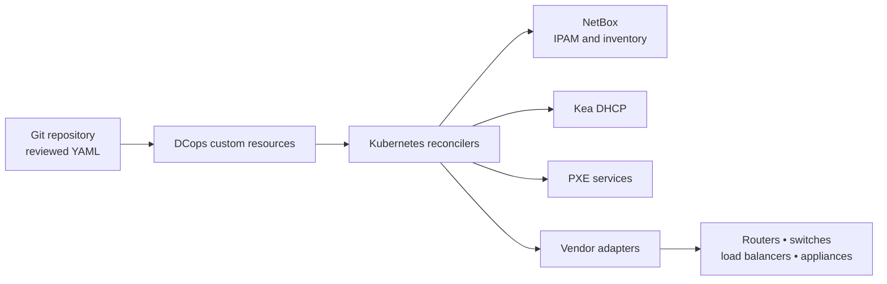

# DCops: GitOps control for infrastructure Kubernetes cannot manage natively

> **Declare infrastructure intent in Git. Let controllers make it true across the systems that actually run your estate.**

Cloud-native teams have a mature operating model inside Kubernetes: declarative resources, reconciliation, policy, reviewable changes and observable status.

The same is rarely true outside the cluster.

IP address management, datacenter inventory, DHCP, PXE boot, switches, routers, load balancers and edge appliances are commonly managed through a mixture of spreadsheets, tickets, vendor interfaces, scripts and operator memory. Each product exposes a different API and few provide a native GitOps workflow.

**DCops brings the Kubernetes controller and GitOps operating model to that infrastructure.**

DCops runs in a Kubernetes management cluster, watches custom resources declared through Git and continuously reconciles desired state into NetBox and external infrastructure systems. Vendor-specific behavior is contained inside adapters; operators work through one consistent, auditable control plane.

---

## Why DCops exists

Infrastructure outside Kubernetes is difficult to automate safely because the challenge is not merely sending configuration to a device.

- Every vendor exposes different APIs, object models and authentication mechanisms.
- Running configuration and persistent configuration may be different states.
- HA pairs, stacks and clusters introduce synchronization and ownership rules.
- A successful API response does not prove that the intended service state is active.
- One-shot scripts do not continuously detect or correct drift.
- Operational ownership is fragmented across tickets, dashboards and runbooks.

DCops treats each infrastructure change as a reconciliation problem:

1. Read the desired state from a Kubernetes custom resource.
2. Discover the actual state in the authoritative system or physical device.
3. Calculate the smallest safe change.
4. Apply that change through a purpose-built adapter.
5. Verify the resulting state rather than trusting the command response.
6. Publish status and events back to Kubernetes.
7. Requeue continuously so drift becomes visible and actionable.

## The operating model



| Layer | Responsibility |
| :--- | :--- |
| **Git** | Desired state, peer review, approvals, audit history and rollback intent |
| **Kubernetes API** | Typed infrastructure resources, validation, RBAC and status |
| **DCops controllers** | Dependency resolution, reconciliation, drift detection, backoff and events |
| **NetBox** | Authoritative IPAM and infrastructure inventory |
| **Vendor adapters** | Product-specific APIs, commit semantics, verification and safe rollback |
| **Operational tooling** | Dashboards, alerts, ownership and fleet-level health |

## Capabilities available today

### Deterministic IP address management

Declare IP pools, prefixes, ranges, VLANs and address claims in Git. DCops reconciles those resources into NetBox and records the resulting object identifiers and status on the Kubernetes resources.

- Deterministic, idempotent allocation
- Conflict prevention
- Dependency-aware reconciliation
- Drift detection and correction
- Multi-tenant resource relationships
- A complete Git audit trail for IPAM changes

### NetBox inventory as an authoritative operational model

DCops manages NetBox resources through typed Kubernetes custom resources rather than requiring operators to configure NetBox manually.

The current model covers infrastructure concepts including:

- tenants and tenant groups
- regions, site groups, sites and locations
- manufacturers, platforms, device types and device roles
- devices, interfaces and MAC addresses
- prefixes, IP ranges, IP addresses, VLANs, VRFs and route targets
- tags and other supporting metadata

Git remains the source of desired state. NetBox remains the authoritative database for IPAM and physical infrastructure inventory. DCops continuously keeps the two aligned.

### Kea DHCP reconciliation

The DHCP controller watches NetBox-backed prefix, range and address resources and translates them into ISC Kea configuration through the Kea Control Agent.

- Full synchronization at controller startup
- Event-driven reconciliation when resources change
- Configuration generation and comparison before application
- Kea configuration testing before activation
- DHCP pools derived from populated NetBox ranges
- MAC-keyed reservations for stable workload addressing

### Controlled PXE boot

DCops models boot profiles and boot intent declaratively so that provisioning and recovery operations can be controlled through reviewed state rather than unmanaged DHCP/PXE changes.

- Declarative boot profiles and intent
- Safer server and cluster rebuilds
- Protection against accidental or repeated installation loops
- Status-driven workflows that can be audited through Kubernetes and Git

### RouterOS adapter foundation

The repository includes a modular RouterOS controller and client foundation for MikroTik RouterOS and SwitchOS device management. It establishes the same controller/client separation intended for additional vendor adapters.

RouterOS device management remains a phased capability; consult the controller and crate status before treating individual operations as production-ready.

## Extending GitOps across a disparate vendor estate

DCops is not limited to NetBox. Its longer-term role is to provide a consistent reconciliation contract across infrastructure products that were never designed for GitOps.

```text
capability discovery
        ↓
inspect observed state
        ↓
stage the smallest safe change
        ↓
activate using vendor-specific semantics
        ↓
verify device state and live service behavior
        ↓
retain rollback state and clean up safely
```

An adapter is responsible for the difficult product-specific details:

- API and model-version discovery
- authentication and least-privilege access
- running versus persistent configuration
- HA, stack or device-group coordination
- idempotent object naming and drift comparison
- activation, read-back verification and rollback
- rate limiting and per-device concurrency control

Unsupported capability is treated as an explicit result. DCops must not silently fall back to an unsafe workflow.

## Certificate management beyond Kubernetes

> **Roadmap capability — not yet implemented in the current controller set.**

cert-manager provides an excellent certificate lifecycle inside Kubernetes. The operational gap begins when a renewed certificate must be installed and activated on infrastructure that cannot consume Kubernetes Secrets or participate in cert-manager reconciliation.

Examples include:

- F5 BIG-IP client and server SSL profiles
- Cisco IOS XE trustpoints
- Cisco IOS XR certificate and PKI services
- Cisco NX-OS management and service certificates
- other load balancers, firewalls, routers, switches and edge appliances

These platforms do not share one certificate API. They use different object stores, profile bindings, YANG models, commit behavior, HA synchronization and persistence mechanisms. Copying certificate files is not enough: the controller must prove that the intended certificate is bound, persistent, synchronized and presented by the live endpoint.

### Proposed certificate lifecycle

1. Detect a changed Kubernetes TLS Secret or an approaching renewal window.
2. Validate the key match, certificate chain, SANs and policy locally.
3. Stage immutable, fingerprinted certificate objects on the target.
4. Activate the intended binding using the device's native semantics.
5. Read back device state and probe the live TLS endpoint.
6. Report success only after verification.
7. Retain the last-known-good version for rollback.
8. Remove old objects only after proving that they are unreferenced.

### Planned adapter strategy

| Platform | Preferred management interface | Important complexity |
| :--- | :--- | :--- |
| **F5 BIG-IP Classic/TMOS** | iControl REST | SSL profile bindings, explicit config save, HA/device-group synchronization |
| **Cisco IOS XE** | RESTCONF or NETCONF; constrained SSH fallback where required | Trustpoints, writable YANG coverage and release variation |
| **Cisco IOS XR** | NETCONF; gNMI for discovery and telemetry where appropriate | CEPKI models, datastore semantics and release variation |
| **Cisco NX-OS** | Model-driven APIs or NX-API | Feature-dependent PKI support, checkpoints and persistence |
| **Legacy or unsupported devices** | Explicit, allowlisted SSH workflow or declared unsupported | No safe universal API exists |

The certificate source should remain a Kubernetes Secret, normally populated by cert-manager or another issuer. DCops should own delivery, activation, verification, status and rollback—not become a certificate authority.

## Operational visibility and alerting

> **Roadmap capability — dashboard and notification integrations are not yet implemented.**

The intended operating model separates fleet-level visibility from resource-level control.

### Datadog operations dashboard

A high-level dashboard should give Operations managers a single view across sites and vendors:

- total certificates under management
- expiry horizons and renewal workload
- failed renewals and failed verification
- drift by site, vendor, environment and owner
- renewal success rate and time-to-remediate
- top exceptions requiring action

### DCops certificate dashboard

The DCops interface should expose the operational detail behind each certificate:

- desired and observed fingerprints
- target device and active binding
- issuer, SANs and expiry
- last reconciliation and verification result
- event history and planned action
- accountable owner and escalation policy
- last-known-good rollback point

### Microsoft Teams and email notifications

Notifications should follow the lifecycle rather than emit undifferentiated expiry noise:

| Event | Timing | Message intent |
| :--- | :--- | :--- |
| **Renewal due** | Policy-driven reminders, such as 90/60/30/14/7 days | Tell the accountable owner what will renew, when and where |
| **Renewal successful** | Only after device read-back and live TLS verification | Confirm the new fingerprint, binding and verification evidence |
| **Renewal failed** | Immediately, with escalation across retries | Identify the failed stage, current safe state, retry and runbook |

## Why GitOps is the preferred control model

Traditional network automation runs a script and considers the job complete when the command succeeds. DCops continuously asks whether the declared state and the observed state agree.

| Traditional device automation | DCops reconciliation |
| :--- | :--- |
| Run a script when someone remembers | Continuously converge desired and observed state |
| Treat a successful command as success | Verify the state and, where possible, the live service |
| Store intent across tickets and operator memory | Store intent, approvals and rollback history in Git |
| Repeat vendor workflows in every runbook | Contain vendor semantics inside adapters |
| Discover drift during incidents | Detect drift continuously and expose it through status |
| Build different security and logging patterns per script | Apply one resource, event and policy model |

Git declares intent. **DCops makes that intent operationally true.**

## Controller architecture

DCops is implemented as a Rust workspace using Kubernetes-native controller patterns:

- `kube-rs` watchers and reconcilers
- typed CRDs generated from Rust definitions
- explicit desired state in `spec`
- observed state and errors in `status`
- Kubernetes Events for SRE visibility
- idempotent reconciliation and conflict handling
- retry policies with bounded backoff
- client traits and mock implementations for testability
- separate controller binaries and vendor/API client crates

Current top-level components include:

```text
controllers/
├── netbox/        # NetBox IPAM and inventory reconciliation
├── dhcp/          # NetBox CRDs → ISC Kea configuration
├── pxe-intent/    # controlled PXE boot intent
└── routeros/      # RouterOS/SwitchOS adapter foundation

crates/
├── crds/             # typed Kubernetes resource definitions
├── netbox-client/    # modular NetBox API client
├── pxe-server/       # PXE service components
└── routeros-client/  # RouterOS API client
```

## Who DCops is for

### SRE and platform teams

- Replace spreadsheet and ticket-driven infrastructure changes with reviewed manifests.
- Detect drift rather than discovering it during an incident.
- Use familiar Kubernetes status, Events, RBAC and GitOps workflows.
- Roll back desired state through version-controlled changes.

### Network and datacenter teams

- Keep NetBox inventory and IPAM aligned with declared infrastructure.
- Encode vendor-specific safety rules once in an adapter.
- Manage multiple sites, tenants and infrastructure families consistently.
- Retain product expertise without requiring every operator to memorize every API.

### Engineering and operations managers

- See ownership, risk and fleet health across systems.
- Reduce manual coordination and repeated operational work.
- Make infrastructure changes reviewable and auditable.
- Expand automation incrementally by device family and proven capability.

## Technology foundation

- **Kubernetes** — controller runtime, CRDs, RBAC, Secrets, status and Events
- **GitOps** — desired state, review, audit history and rollback intent
- **NetBox** — authoritative IPAM and datacenter inventory
- **ISC Kea** — DHCP configuration and stable MAC-keyed reservations
- **Rust** — memory-safe, modular controllers and API clients
- **Vendor APIs** — purpose-built adapters for infrastructure outside Kubernetes

## Getting started

DCops runs in a Kubernetes management cluster alongside NetBox and its supporting services.

### Development environment

The recommended development path uses the repository's preconfigured Dev Container and a local k3s management cluster.

**Supported IDEs**

- VS Code with Dev Containers
- JetBrains IDEs with Remote Development

**Prerequisites included by the Dev Container**

- Rust toolchain
- Docker-in-Docker
- `kubectl`, Tilt and Kubernetes development tooling
- Python 3 and repository scripts
- `just`, `cargo-nextest`, coverage and audit tooling

Start with:

```bash
just verify-shared-k8s
just dev-up
```

DCops deploys to the `shared-k8s` context. The shared cluster and registry are managed by the sibling `shared-gitops-k8s-cluster` repository.

See [`.devcontainer/README.md`](.devcontainer/README.md) and [CONTRIBUTING.md](CONTRIBUTING.md) for the full setup and development workflow.

## Documentation

- [Contributing and controller architecture](CONTRIBUTING.md)
- [Populated NetBox IP range handling](docs/NETBOX_IP_RANGE_ANALYSIS.md)
- [DHCP controller](controllers/dhcp/README.md)
- [Kea command coverage](controllers/dhcp/KEA_COMMANDS.md)
- [Controller/reconciler architecture](docs/CONTROLLER_RECONCILER_ARCHITECTURE.md)

---

**Infrastructure does not need to be Kubernetes-native to be managed through a Kubernetes-native operating model.**

