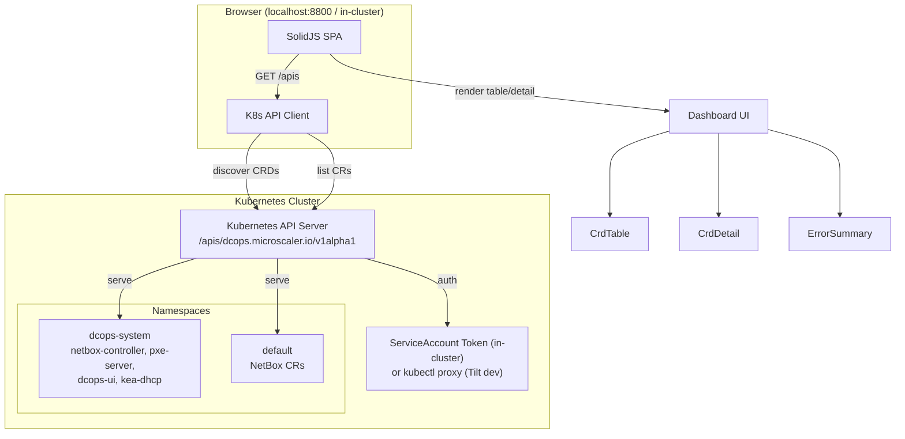
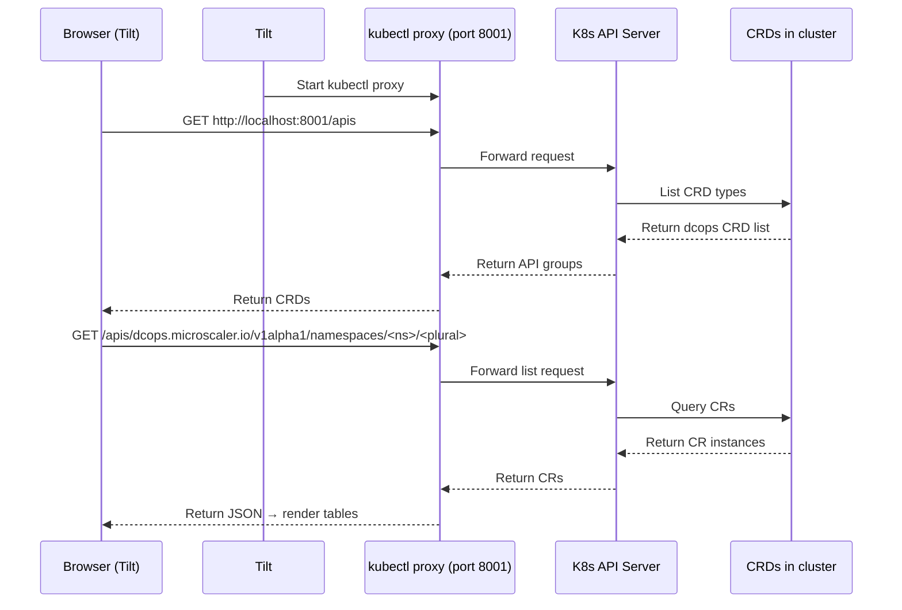
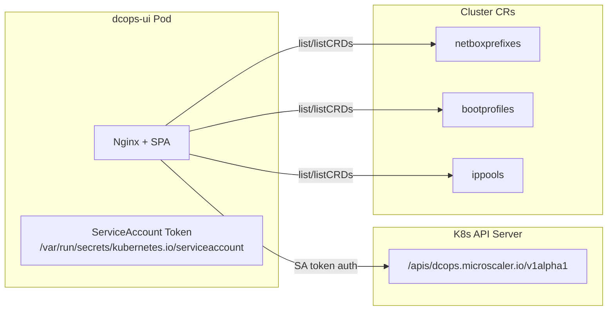
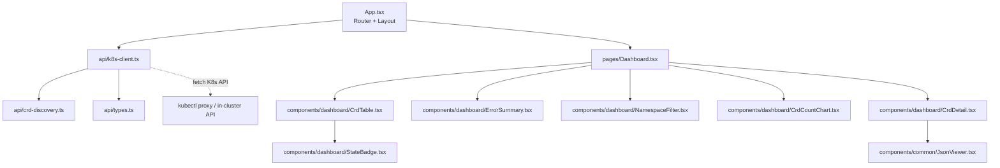
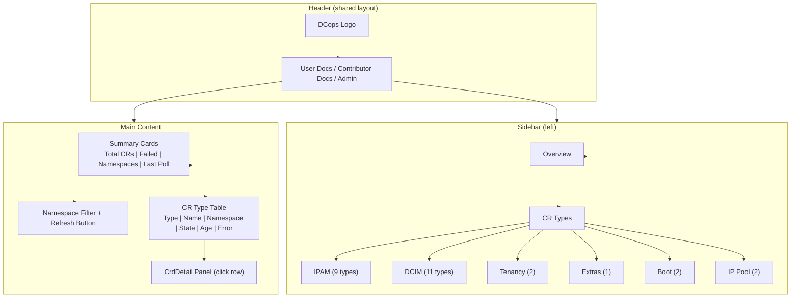
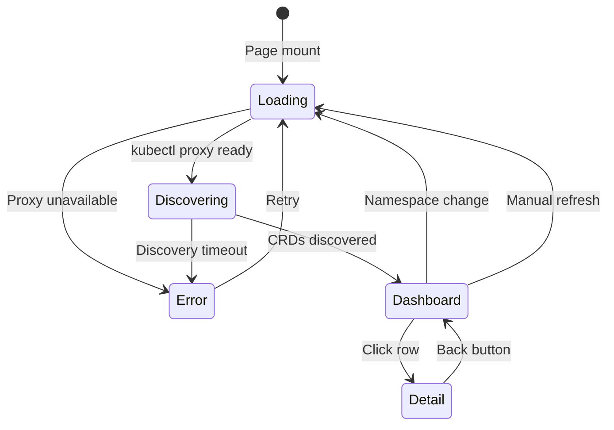

# DCops Dashboard — Platform View UI

> **Type:** Architecture Design Document  
> **Status:** Draft  
> **Priority:** P1  
> **Effort:** 10–14 days  
> **Parent:** DCops platform operational visibility gap  

---

## 1. Problem Statement

Operators and developers have **no visual overview** of the DCops platform. To see what CRs are deployed they must run scattered `kubectl get` commands across 27 CRD types. There is no single pane of glass to answer:

- How many resources are deployed, and by type?
- Which resources are in Failed state?
- What is the reconciliation health of each namespace?

This makes troubleshooting slow and onboarding difficult.

## 2. Goals

- [ ] **Phase 1 (Read-Only):** Auto-discover and display all `dcops.microscaler.io` CRs in the cluster with state, namespace, and error visibility
- [ ] **Phase 2 (Future):** Edit CRs through the UI → gitops apply flow
- [ ] **Integration:** Extend the existing `dcops-ui` (SolidJS/Vite/nginx) — do not replace it
- [ ] **Zero hardcoded CRD list:** Discover CRDs dynamically from the K8s API

## 3. Non-Goals (for Phase 1)

- No write/CRUD operations
- No authentication (runs in-cluster behind the service, or via `kubectl proxy` for Tilt dev)
- No custom backend service — pure static SPA talking directly to K8s API
- No real-time streaming — polling-based (30s interval)

## 4. Architecture

### 4.1 High-Level Data Flow



### 4.2 Tilt Dev Flow

During local development, the UI connects to K8s via `kubectl proxy` running on port 8001.



### 4.3 Production Flow

When deployed to-cluster, the UI pod mounts the default ServiceAccount token and talks directly to the K8s API server.



### 4.4 Component Architecture



## 5. API Design

### 5.1 K8s API Endpoints Used

| Operation | K8s Endpoint | Description |
|-----------|-------------|-------------|
| Discover CRDs | `GET /apis` | List all API groups, filter `dcops.microscaler.io` |
| List CRs by type | `GET /apis/dcops.microscaler.io/v1alpha1/namespaces/{ns}/{plural}` | Get all instances of a CRD |
| Get single CR | `GET /apis/dcops.microscaler.io/v1alpha1/namespaces/{ns}/{plural}/{name}` | Get one CR's full YAML |
| List namespaces | `GET /api/v1/namespaces` | Available namespaces |

### 5.2 TypeScript Types

```typescript
// K8s Resource — generic shape for any CR
interface K8sResource {
  apiVersion: string;
  kind: string;
  metadata: {
    name: string;
    namespace: string;
    creationTimestamp: string;
    labels?: Record<string, string>;
    annotations?: Record<string, string>;
  };
  spec: Record<string, unknown>;
  status?: Record<string, unknown>;
}

// Discovered CRD metadata
interface CrdMeta {
  plural: string;
  kind: string;
  category: CrdCategory;
}

type CrdCategory = 'ipam' | 'dcim' | 'tenancy' | 'extras' | 'boot' | 'ippool';

// CRD list response — grouped by category
interface DashboardData {
  crds: CrdMeta[];
  instances: Map<string, K8sResource[]>; // key = plural
  namespaces: string[];
  summary: {
    total: number;
    byCategory: Record<string, number>;
    byState: Record<string, number>; // Created, Failed, Pending
    withErrors: number;
  };
}
```

### 5.3 API Client Interface

```typescript
export class K8sClient {
  private proxyUrl: string;

  constructor(proxyUrl = 'http://localhost:8001') {
    this.proxyUrl = proxyUrl;
  }

  // Discover all dcops CRD plurals
  async listCrdPlurals(): Promise<CrdMeta[]>;

  // List CRs of one type across namespaces
  async listCrds(plural: string, namespace: string): Promise<K8sResource[]>;

  // Get single CR by name
  async getCrds(plural: string, namespace: string, name: string): Promise<K8sResource>;

  // List all namespaces
  async listNamespaces(): Promise<string[]>;

  // Fetch all CRs for dashboard (optimizes to single call per namespace)
  async fetchAllDashboardData(namespaces: string[]): Promise<DashboardData>;
}
```

## 6. UI Layout

### 6.1 Dashboard Page



### 6.2 Page States



## 7. CRD Categories

The 27 CRDs are grouped into 6 logical categories for navigation and display:

| Category | Plurals | Count |
|----------|---------|-------|
| **IPAM** | netboxprefixes, netboxipaddresses, netboxipranges, netboxaggregates, netboxvlans, netboxrirs, netboxvrfs, netboxroutetargets, netboxroles | 9 |
| **DCIM** | netboxdevices, netboxdeviceroles, netboxdevicetypes, netboxinterfaces, netboxmacaddresses, netboxlocations, netboxsites, netboxsitegroups, netboxregions, netboxmanufacturers, netboxplatforms | 11 |
| **Tenancy** | netboxtenants, netboxtenantgroups | 2 |
| **Extras** | netboxtags | 1 |
| **Boot** | bootprofiles, bootintents | 2 |
| **IP Pool** | ippools, ipclaims | 2 |

## 8. File Structure

```
ui/src/
├── api/
│   ├── k8s-client.ts       # K8s API client (proxy-based)
│   ├── crd-discovery.ts    # Auto-discover CRDs from K8s /apis
│   └── types.ts            # Shared TS types
├── components/
│   ├── dashboard/
│   │   ├── Dashboard.tsx           # Main dashboard (overview + table)
│   │   ├── CrdTable.tsx            # Generic sortable/filterable CR table
│   │   ├── CrdDetail.tsx           # Single CR detail panel
│   │   ├── CrdCountChart.tsx       # CR distribution by type/category
│   │   ├── StateBadge.tsx          # State indicator (Created/Failed/Pending)
│   │   ├── NamespaceFilter.tsx     # Namespace dropdown selector
│   │   └── ErrorSummary.tsx        # Failed CRs accordion list
│   └── common/
│       ├── LoadingSpinner.tsx      # Loading indicator
│       ├── ErrorBanner.tsx         # Error display with retry
│       └── JsonViewer.tsx          # Syntax-highlighted JSON display
├── pages/
│   ├── Dashboard.tsx           # Dashboard entry point
│   └── CrdDetail.tsx           # Single CR view (standalone too)
└── ... (existing documentation pages unchanged)
```

## 9. Tilt Integration

Add to Tiltfile:

```python
# Start kubectl proxy for local dev
local_resource(
    'kubectl-proxy',
    cmd='kubectl proxy --port=8001 --address=127.0.0.1 --accept-hosts="^localhost$|^127\\.0\\.0\\.1$"',
    labels=['infrastructure'],
)

# Update dcops-ui resource to depend on proxy
k8s_resource(
    'dcops-ui',
    port_forwards='8800:80',
    labels=['docs'],
    resource_deps=['kubectl-proxy'],  # ensure proxy is ready
)
```

## 10. Production Deployment

When deployed in-cluster:
- The UI Deployment mounts the default ServiceAccount token (standard K8s pattern)
- `K8sClient` detects in-cluster mode (no proxy URL) and uses the SA token
- API calls go directly to `https://kubernetes.default.svc:443`
- RBAC: ServiceAccount needs `get`, `list` on all `dcops.microscaler.io` resources

### Required RBAC

```yaml
apiVersion: rbac.authorization.k8s.io/v1
kind: ClusterRole
metadata:
  name: dcops-ui-reader
rules:
  - apiGroups: ["dcops.microscaler.io"]
    resources: ["*"]
    verbs: ["get", "list"]
  - apiGroups: [""]
    resources: ["namespaces"]
    verbs: ["list"]
---
apiVersion: rbac.authorization.k8s.io/v1
kind: ClusterRoleBinding
metadata:
  name: dcops-ui-reader
subjects:
  - kind: ServiceAccount
    name: default
    namespace: dcops-system
roleRef:
  kind: ClusterRole
  name: dcops-ui-reader
  apiGroup: rbac.authorization.k8s.io
```

## 11. Open Questions

| # | Question | Default Resolution |
|---|----------|-------------------|
| **Q1** | Should the Dashboard be a separate section or integrated into the existing navigation? | Separate section ("Admin") added to the header nav, parallel to "User Docs" and "Contributor Docs" |
| **Q2** | How to handle the 27 CRD types if there are thousands of CR instances? | Lazy load per category — load CRDs first, then fetch CRs only when a category is expanded. Paginate table at 50 rows. |
| **Q3** | Should the API client support both proxy and in-cluster modes? | Yes — `K8sClient` constructor takes `proxyUrl` (dev) or `null` (prod, uses SA token). Auto-detect via `window.location.hostname`. |
| **Q4** | What polling interval for refresh? | 30 seconds default, adjustable. Manual refresh button always available. |
| **Q5** | Do we need to handle multiple API versions (v1alpha1 only for now)? | Yes — discover API groups dynamically; assume `v1alpha1` as default version. |
