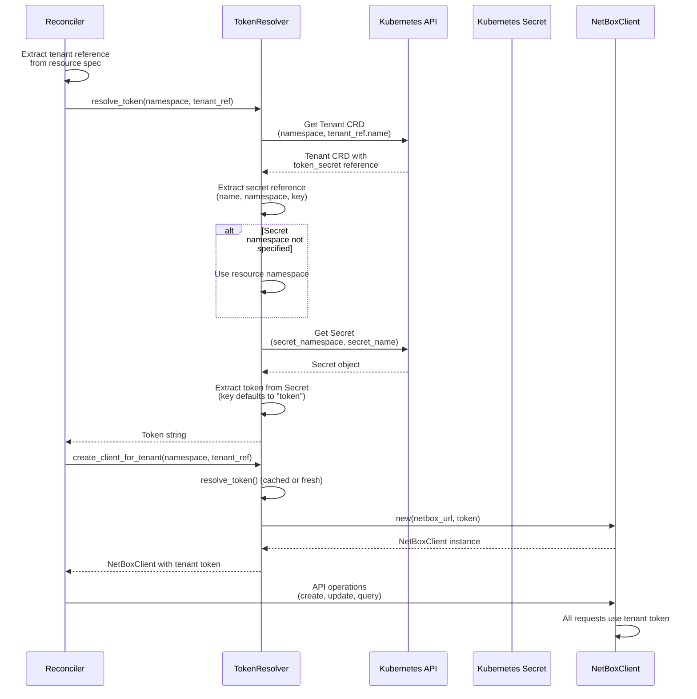
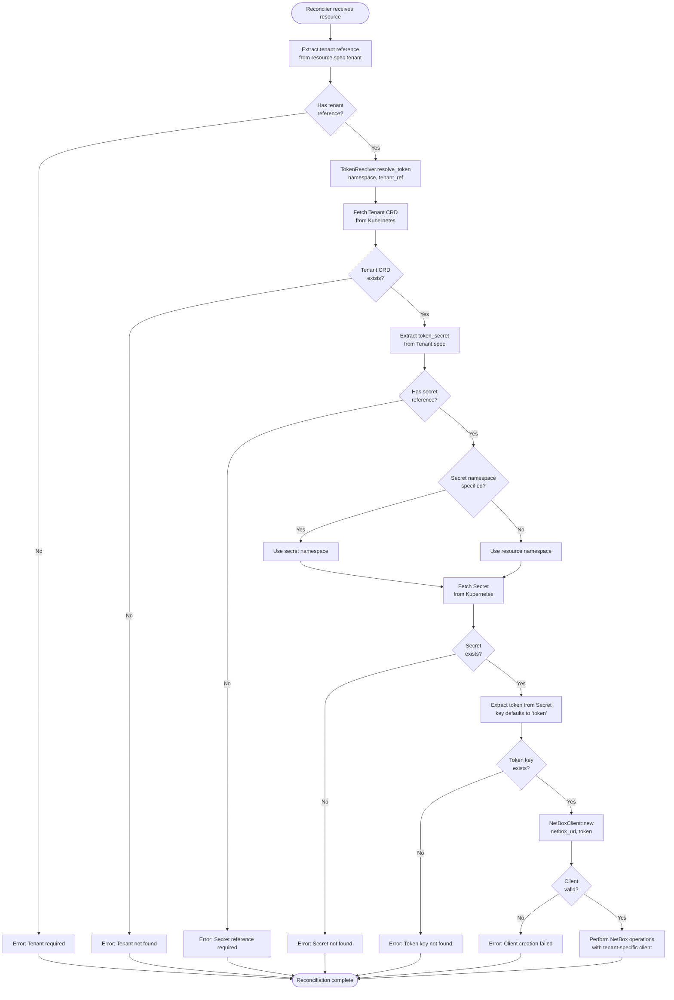
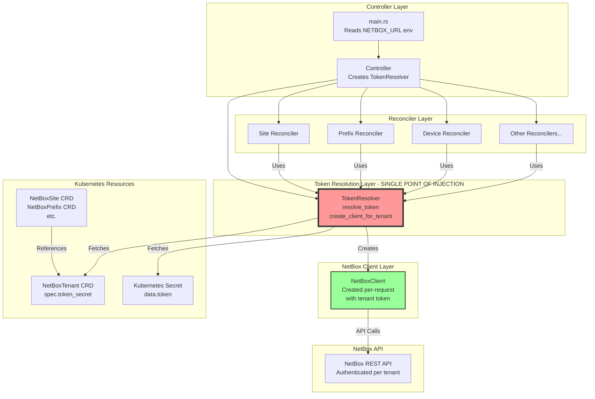
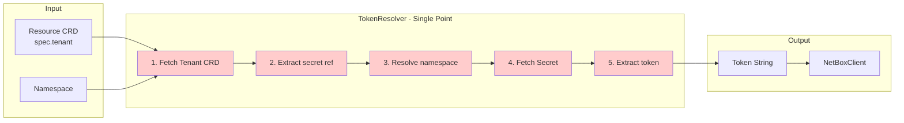

# Multi-Tenant NetBox Client Architecture

## Overview

This document describes the multi-tenant architecture for the NetBox controller, where each tenant has its own NetBox API token stored in a Kubernetes Secret.

## Design Principles

1. **Single Point of Dependency Injection**: All token resolution happens in one place
2. **Per-Request Client Creation**: NetBoxClient is created per reconciliation with tenant-specific token
3. **Tenant Isolation**: Each tenant's resources use their own token
4. **Secret Security**: Tokens are stored in Kubernetes Secrets, referenced by Tenant CRD

## Architecture Components

### 1. Tenant CRD Enhancement

```rust
pub struct NetBoxTenantSpec {
    pub name: String,
    pub slug: Option<String>,
    pub description: Option<String>,
    pub comments: Option<String>,
    pub group: Option<NetBoxResourceReference>,
    
    // NEW: Secret reference for tenant's NetBox API token
    pub token_secret: SecretReference,
}

pub struct SecretReference {
    pub name: String,           // Secret name
    pub namespace: Option<String>, // Optional namespace (defaults to CR namespace)
    pub key: Option<String>,    // Optional key (defaults to "token")
}
```

### 2. Token Resolver Service

**Single Point of Dependency Injection**

```rust
pub struct TokenResolver {
    kube_client: Client,
    netbox_url: String,
}

impl TokenResolver {
    /// Resolves token for a tenant reference
    /// This is the SINGLE POINT of token resolution
    pub async fn resolve_token(
        &self,
        namespace: &str,
        tenant_ref: &NetBoxResourceReference,
    ) -> Result<String, TokenResolutionError> {
        // 1. Fetch Tenant CRD
        // 2. Extract secret reference
        // 3. Fetch Secret
        // 4. Extract token
        // 5. Return token
    }
    
    /// Creates a NetBoxClient with resolved token
    pub async fn create_client_for_tenant(
        &self,
        namespace: &str,
        tenant_ref: &NetBoxResourceReference,
    ) -> Result<NetBoxClient, TokenResolutionError> {
        let token = self.resolve_token(namespace, tenant_ref).await?;
        NetBoxClient::new(self.netbox_url.clone(), token)
            .map_err(|e| TokenResolutionError::ClientCreation(e))
    }
}
```

### 3. Reconciler Changes

Reconcilers will:
- Extract tenant reference from resource
- Use `TokenResolver` to get tenant-specific client
- Perform operations with tenant-specific client

## Flow Diagrams

### Sequence Diagram: Token Resolution and Client Creation



### Flowchart: Multi-Tenant Reconciliation Flow



### Component Architecture Diagram



### Data Flow: Token Resolution Details



## Implementation Details

### TokenResolver Interface

```rust
pub struct TokenResolver {
    kube_client: Client,
    netbox_url: String,
    // Optional: Token cache per tenant to avoid repeated Secret fetches
    // token_cache: Arc<Mutex<HashMap<String, CachedToken>>>,
}

impl TokenResolver {
    /// SINGLE POINT OF TOKEN RESOLUTION
    /// All token resolution flows through this method
    pub async fn resolve_token(
        &self,
        namespace: &str,
        tenant_ref: &NetBoxResourceReference,
    ) -> Result<String, TokenResolutionError> {
        // Implementation details...
    }
    
    /// SINGLE POINT OF CLIENT CREATION
    /// All NetBoxClient creation with tenant tokens flows through this
    pub async fn create_client_for_tenant(
        &self,
        namespace: &str,
        tenant_ref: &NetBoxResourceReference,
    ) -> Result<NetBoxClient, TokenResolutionError> {
        let token = self.resolve_token(namespace, tenant_ref).await?;
        NetBoxClient::new(self.netbox_url.clone(), token)
            .map_err(TokenResolutionError::ClientCreation)
    }
}
```

### Reconciler Changes

```rust
impl Reconciler {
    pub async fn reconcile_site(&self, site: &NetBoxSite) -> Result<(), ControllerError> {
        // Extract tenant reference
        let tenant_ref = &site.spec.tenant;
        let namespace = site.metadata.namespace.as_deref().unwrap_or("default");
        
        // SINGLE POINT: Get tenant-specific client
        let netbox_client = self.token_resolver
            .create_client_for_tenant(namespace, tenant_ref)
            .await?;
        
        // Use tenant-specific client for all operations
        // ... reconciliation logic ...
    }
}
```

## Benefits

1. **Single Point of Injection**: All token resolution in `TokenResolver`
2. **Security**: Tokens stored in Kubernetes Secrets, not in CRDs
3. **Multi-Tenancy**: Each tenant isolated with own token
4. **Flexibility**: Secret namespace can differ from resource namespace
5. **Testability**: TokenResolver can be mocked for unit tests
6. **Caching Opportunity**: Can cache tokens per tenant to reduce Secret API calls

## Migration Path

1. Add `token_secret` field to `NetBoxTenantSpec`
2. Create `TokenResolver` service
3. Update `Controller` to create `TokenResolver` instead of single `NetBoxClient`
4. Update all reconcilers to use `TokenResolver.create_client_for_tenant()`
5. Remove `NETBOX_TOKEN` environment variable requirement
6. Update deployment to remove token from environment

