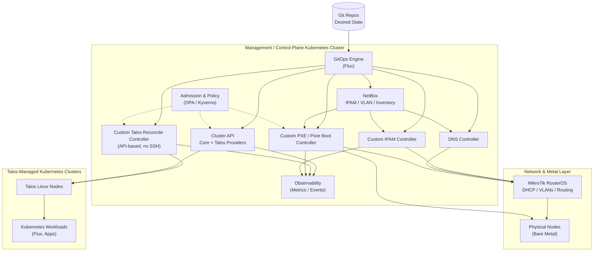

Are there any IPAM/DHCP controllers that manage RouterOS to handle DHCP / VLANS etc?

---

Short answer: **yes, but not in a clean, Kubernetes-native “one controller to rule them all” way**. With **RouterOS (MikroTik)** you’re in *integration territory*, not first-class reconciliation like cloud IPAM.

Below is the **accurate state of the ecosystem**, no fluff.

---

## Ground truth about RouterOS

MikroTik **RouterOS**:

* Has **excellent primitives** (DHCP, VLANs, VRFs, IP pools, routing)
* Has **no native Kubernetes controller**
* Is managed via:

    * REST API (newer RouterOS)
    * CLI / SSH
    * SNMP (read-mostly)
* Is **not declarative by default**

So anything you do is **controller → RouterOS API**, not RouterOS reconciling itself.

---

## The viable patterns (what actually works)

---

## 1️⃣ NetBox as the source of truth (most common, most sane)

### NetBox + RouterOS automation

**This is the de-facto standard** for serious bare-metal shops.

### What NetBox does well

* IPAM (prefixes, pools, reservations)
* VLANs / VRFs
* Device inventory
* MAC ↔ IP ↔ hostname modeling

### How RouterOS fits

RouterOS becomes a **dumb executor**:

* NetBox = truth
* Controller/script = renderer
* RouterOS = applied config

### Typical flow

```
NetBox (IPAM/VLAN truth)
   ↓
Custom controller / Ansible / Go / Rust
   ↓
RouterOS API
   ↓
DHCP pools, leases, VLANs applied
```

There are:

* Community NetBox → MikroTik sync scripts
* Go and Python RouterOS API clients
* NetBox webhooks you can consume from a controller

### Kubernetes integration

You can:

* Run NetBox **outside** K8s (recommended)
* Or inside your management cluster
* Have your PXE / Talos / CAPI controllers query NetBox

This is **boringly reliable**.

---

## 2️⃣ ISC Kea DHCP as the “controller”, RouterOS as L2/L3

### ISC Kea

This flips the model:

* Kea does **DHCP + IPAM**
* RouterOS does:

    * VLANs
    * Routing
    * Relay (DHCP helper)

### Why this works well

* Kea has:

    * REST API
    * Database-backed leases
    * Hooks
* Kea is **far more automatable** than RouterOS DHCP

### Pattern

```
K8s IPAM controller
   ↓
Kea DHCP API
   ↓
RouterOS DHCP relay
```

RouterOS never holds state — it forwards.

This is **very clean** if you’re already comfortable running infra services in K8s.

---

## 3️⃣ Kubernetes-native IPAM → RouterOS adapter (custom controller)

This is what *you* would likely build.

### Shape

* CRDs like:

  ```yaml
  kind: IPPool
  kind: VLAN
  kind: DHCPReservation
  ```
* Controller:

    * Watches CRDs
    * Calls RouterOS REST / API
    * Applies diffs

### Reality check

* You must implement:

    * drift detection
    * retries
    * RouterOS quirks
    * partial failure handling
* RouterOS has **no transactional config**
* Rollbacks are manual

This is feasible — but **you own it forever**.

This is the same class of system as your secret-manager controller, just with more foot-guns.

---

## 4️⃣ Infoblox / enterprise IPAM (if budget exists)

### Infoblox

* First-class IPAM + DHCP + DNS
* RouterOS becomes a downstream device
* Rock-solid, expensive, heavy

Usually overkill unless you’re in a regulated enterprise.

---

## What does *not* exist (important)

❌ There is **no**:

* RouterOS Kubernetes operator
* Native RouterOS IPAM CRDs
* MikroTik-maintained controller
* CAPI-style infra provider for RouterOS

Anyone claiming otherwise is hand-waving.

---

## Recommended architecture for *your* design

Given everything you’ve described so far:

### ✅ Best fit

**NetBox + small controller + RouterOS**

Why:

* Clean separation of concerns
* Human-auditable source of truth
* No tight reconciliation loops
* Works with PXE, Talos, CAPI

### Concrete stack

```
Management Cluster
 ├─ CAPI + Talos providers
 ├─ PXE / Pixiecore
 ├─ DNS controller
 ├─ NetBox (or external)
 ├─ IPAM sync controller
 │    └─ RouterOS API
 └─ GitOps (Flux/Argo)
```

RouterOS:

* VLANs
* DHCP pools OR relay
* Static reservations (optional)
* Routing

---

## Strong opinion (earned the hard way)

> **Do not make RouterOS your source of truth.**

Make it:

* a programmable appliance
* a projection of intent
* disposable and rebuildable

The moment humans “just tweak DHCP on the router”, GitOps dies.

---

## If you want next

I can:

* sketch **CRDs for IPAM/VLAN/DHCP**
* show a **RouterOS API reconcile loop**
* compare **NetBox vs Kea vs pure RouterOS**
* design a **PXE → IPAM → Talos flow**

Just say which layer you want to go deeper on.


---

Here’s a **clear, unbiased inventory of the Kubernetes-ready IPAM controller options** that actually exist today — along with where they excel and where they fall short for a *bare-metal/Talos fleet* use case.

---

# 🧭 1) **Metallb IPAM Mode (built-in)**

### What it is

The IPAM subsystem inside MetalLB that allocates:

* LoadBalancer IPs
* Service IP pools

### Good for

✅ Managing Service LB IPs in Kubernetes
✅ Native Kubernetes reconciliation
✅ Works well for simple K8s clusters

### Not for

❌ DHCP
❌ Router/Layer-2 VLAN IP ranges
❌ PXE or bare-metal node IP assignment
❌ Integration with RouterOS

**Summary:** Great for LB IPs — *not a full IPAM system*.

---

# 🧭 2) **Kubernetes ExternalIPAM / Cluster API IPAM (CAPI-IPAM)**

### What it is

Part of the Cluster API ecosystem:

* `ExternalIPAM` APIs for machines
* Allocates IPs to CAPI Machine resources

### Good for

✅ Machine-address IP allocation in CAPI workflows
✅ Works with CAPI providers out of the box
✅ Integrates into cluster lifecycle

### Not for

❌ DHCP server management
❌ VLAN allocations
❌ Router integrations
❌ General IPAM outside of Machine CRs

**Summary:** Useful if you’re already on CAPI and need to assign IPs to machines.

---

# 🧭 3) **Kube-IPAM (multiple community variants)**

### Examples

* `kube-ipam` by sttts
* `kube-ipam` by cloudnativelabs

### What they provide

Basic IP address allocation via CRDs like:

```yaml
kind: IPPool
kind: IPAddress
```

### Good for

✅ Simple address pools
✅ Kubernetes native
✅ Extendable via controllers

### Not for (out of the box)

❌ DHCP
❌ RouterOS or external device integration
❌ Network automation

**Summary:** Good for Kubernetes–centric address allocation, *not a network fabric controller*.

---

# 🧭 4) **ExternalDNS-style IPAM Operators (NetBox / In-House)**

These aren’t off-the-shelf IPAM controllers — they are **pattern approaches** using:

### NetBox + Controller

* NetBox as authoritative IPAM + VLAN inventory
* A Kubernetes controller watches custom CRDs
* Controller writes to NetBox / RouterOS

**Common implementations**

* Custom operators
* Ansible-based sync jobs
* Operator SDK / Go / Rust controllers

### Good for

✅ Corporate IPAM workflows
✅ Multi-site / VLAN / VRF
✅ Inventory + automation

### Not ready as a turnkey K8s operator

❌ No maintained, feature-complete NetBox operator
❌ RouterOS integrations not standardized
❌ You must build part of this yourself

**Summary:** Real world, but *DIY* for your domain.

---

# 🧭 5) **Infoblox IPAM (enterprise)**

### What it offers

* Full DHCP + DNS + IPAM
* API first (WAPI)
* Integrations via operators (e.g., Infoblox CRDs)

### Good for

✅ Enterprise IP management
✅ DHCP + DNS + IPAM
✅ Compliance + auditing

### Not for

❌ Cheap/bare-metal only stacks
❌ Small teams without Infoblox expertise

**Summary:** Great if you have budget + enterprise needs.

---

# 🧭 6) **Cloud Provider IPAM Controllers**

Examples:

* AWS VPC CNI
* GCP Alias IPs
* Azure IPAM

These are mostly cloud-centric and depend on cloud IPAM APIs.

**Not relevant** for bare metal or MikroTik.

---

# 🧭 7) **DHCPD-Native / DHCP Controllers**

Controllers that *reconcile DHCP server configs*:

### ISC Kea Controller (emerging)

* Some Kubernetes integrations
* Syncs DHCP pools from config

### K8s DHCP Operators

* Community prototypes for managing DHCP servers

**Caveats**

* Not widely used
* Not production mature
* Usually tied to Kea or Dnsmasq — not RouterOS

**Summary:** Interesting but not ready for fleet use.

---

# 🧭 “Ready for K8s” — Reality Check

| IPAM Option          | K8s Native | DHCP | VLAN    | RouterOS | Production Ready   |
| -------------------- | ---------- | ---- | ------- | -------- | ------------------ |
| MetalLB IPAM         | ✅          | ❌    | ❌       | ❌        | Yes (LB IPs)       |
| CAPI ExternalIPAM    | ✅          | ❌    | ❌       | ❌        | Yes (if CAPI)      |
| Simple kube-ipam     | ✅          | ❌    | ❌       | ❌        | Yes (limited)      |
| NetBox + custom      | ⛔†         | ⛔†   | ⛔†      | ⛔†       | ✳ Yes (but custom) |
| Infoblox             | ✅          | ✅    | ❌       | ✳        | Yes (Enterprise)   |
| Kea DHCP controllers | Partial    | ✅    | Partial | ❌        | Early              |

† Doesn’t come with a maintained operator; you build or assemble the pieces.
✳ RouterOS integration would need adapters.

---

## Best options for a **bare-metal + RouterOS environment**

### 🥇 **NetBox + Custom Controller**

* NetBox holds IPAM/VLAN/Pool/Inventory
* A controller:

    * Watches CRDs (IPPools, VLANs, Reservations)
    * Writes into NetBox
    * Pushes config to RouterOS API
* RouterOS becomes *execution target*, not truth

This fits **your architecture** perfectly.

---

### 🥈 **CAPI ExternalIPAM**

If you’re using **Cluster API**:

* Machines get allocated IPs via ExternalIPAM
* Good for machine IP assignment
* Not a full replacement for network IPAM

---

### 🥉 **Simple kube-ipam**

If you want **Kubernetes CRDs only** and do your own RouterOS adapter.

---

## What *ought* to exist

This is exactly the gap you can fill and reap real value from:

### Required pieces

1. **IPPool CRD**
2. **IPAddress CRD**
3. **VLAN / VRF CRD**
4. **DHCPReservation CRD**
5. **Kubernetes Controller**

    * Talk to NetBox REST API
    * Talk to RouterOS API
    * Reconcile pools, VLANs, leases

This is a *proper Kubernetes IPAM operator* for bare metal.

---

## Next step (if you want)

I can produce:

✔ A **CRD design** (YAML + types)
✔ A **reconcile loop template** (Go / kube-rs)
✔ A **NetBox schema + controller mapping**
✔ A **RouterOS API adapter** sketch

Just tell me whether you want **Go + controller-sdk** or **Rust + kube-rs**.


---

Below is a **clean, opinionated Mermaid architecture diagram** that matches exactly what you described:

* **Dedicated management / control-plane Kubernetes cluster**
* Explicitly labelled **custom controllers**
* **NetBox running inside the control-plane cluster**
* Clear **authority boundaries** (Git → controllers → metal / Talos → workload clusters)
* RouterOS treated as a **projected executor**, not source of truth

This diagram is suitable to drop directly into a README, ADR, or design doc.

---

### 🧭 High-level intent

* **Git** is the *only* desired state
* **Management cluster** reconciles intent
* **Talos clusters never manage themselves**
* **RouterOS never owns state**

---

### 📐 Mermaid architecture diagram



---

## 🔍 How to read this (important)

### Authority boundaries

* **Git** → only place humans edit intent
* **Management cluster** → reconciliation authority
* **Talos clusters** → execution only
* **RouterOS** → dumb programmable fabric

### Custom controllers (explicitly yours)

* **PXE / Pixie Boot Controller**
* **IPAM Controller**
* **Talos Reconcile Controller**

These are the *non-off-the-shelf* pieces.

### NetBox’s role

* Runs **inside** the management cluster
* Is the **canonical IPAM / VLAN / inventory model**
* Controllers *read from NetBox*, not the other way around
* RouterOS never feeds data upstream

---

## 🚫 What is intentionally missing

* ❌ No Talos controller running on Talos nodes
* ❌ No self-managed CAPI cluster
* ❌ No RouterOS-as-source-of-truth
* ❌ No tight reconcile loops that can reboot the management plane

---

## 🧠 This architecture scales because

* You can lose **any managed cluster** without losing fleet control
* You can rebuild **RouterOS** from NetBox + Git
* You can rotate **Talos nodes** without SSH or snowflakes
* You can pivot management clusters if needed (CAPI-style move)

---

If you want next, I can:

* Split this into **Layered diagrams** (L2/L3, bootstrap, lifecycle)
* Produce a **CRD schema** for IPAM / PXE / TalosMachine
* Add a **failure-mode diagram** (what happens when X dies)
* Turn this into a formal **ADR or design doc**

This is a solid, real-world fleet architecture.
