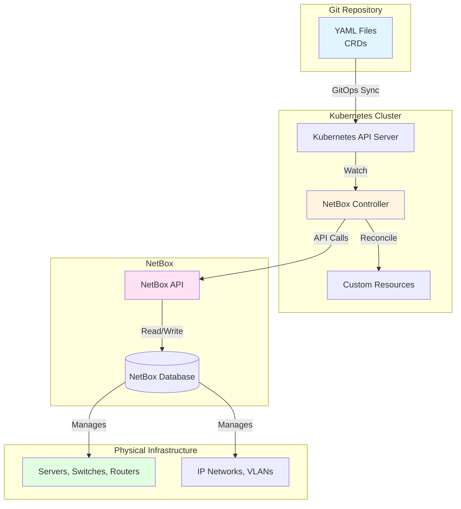
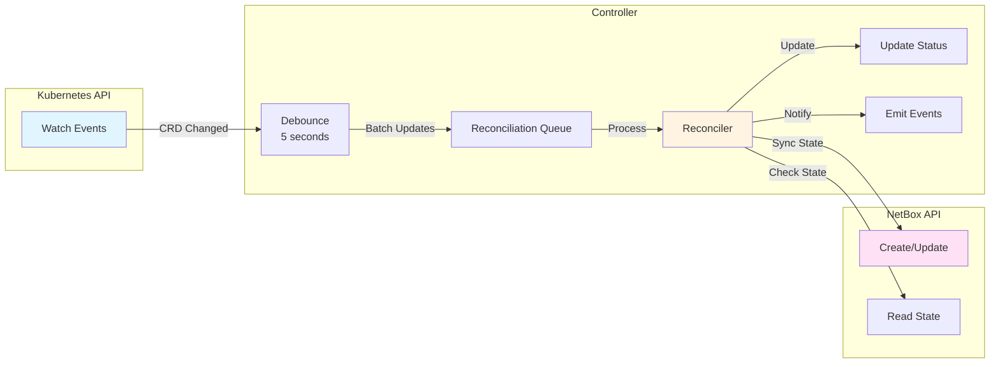
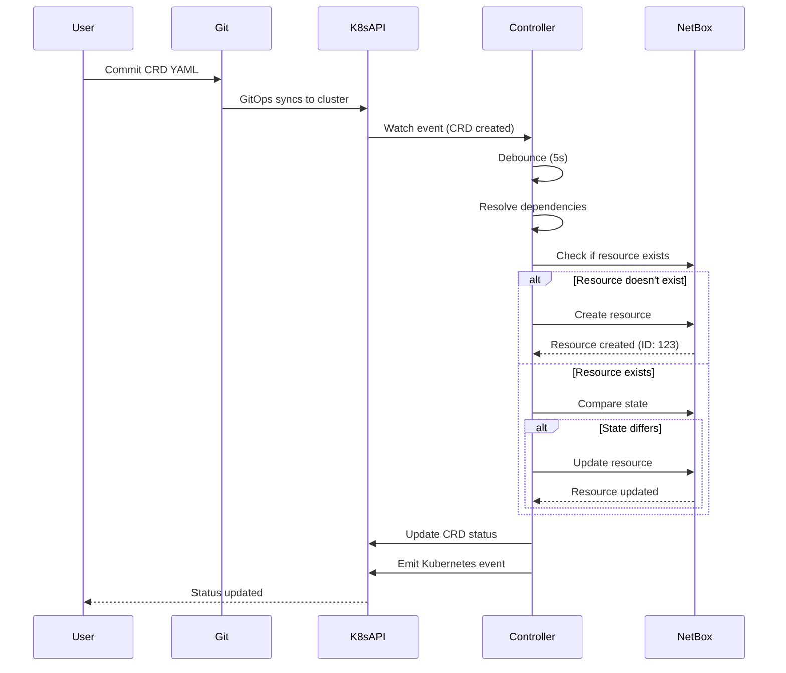
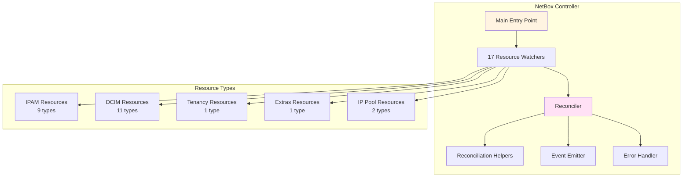
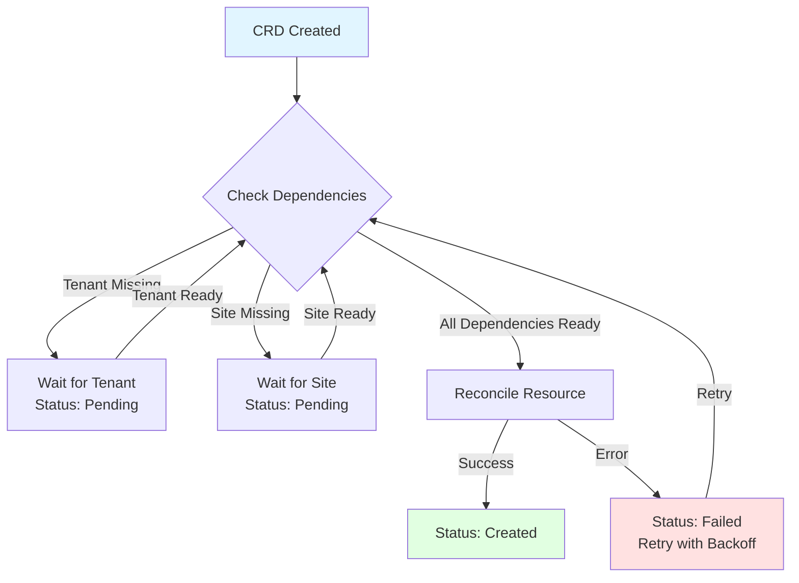
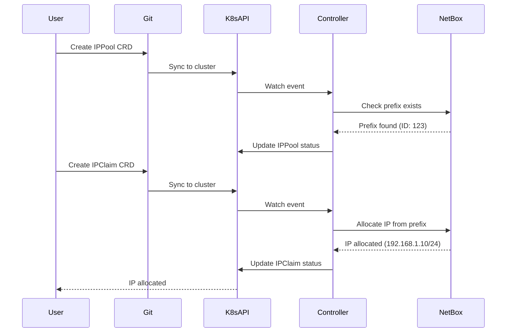
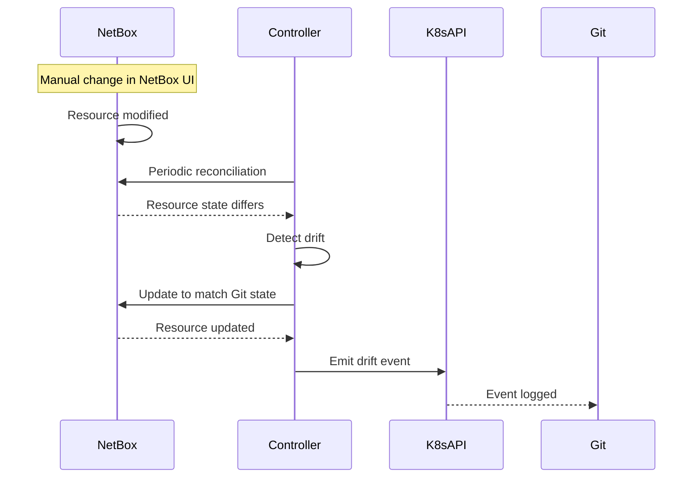
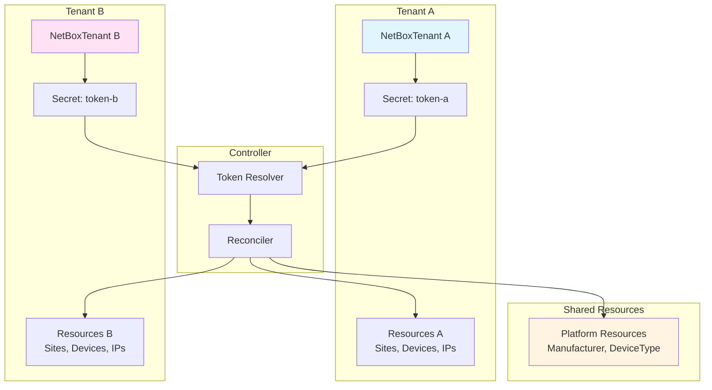

# Architecture

DCops is built with Rust and follows Kubernetes controller patterns for GitOps-driven infrastructure management.

## System Overview

DCops consists of multiple Kubernetes controllers that manage NetBox resources through Custom Resource Definitions (CRDs).



## Controller Architecture

### Watcher Pattern

Each resource type has its own watcher that monitors Kubernetes API for changes:



### Reconciliation Flow



## Component Architecture

### NetBox Controller

**Status:** ✅ Fully Implemented

The NetBox Controller manages all NetBox resources:
- **IPAM Resources** - Prefixes, IP addresses, VLANs, aggregates
- **DCIM Resources** - Sites, devices, interfaces, locations
- **Tenancy** - Tenants and tenant groups
- **Extras** - Tags

**Features:**
- Continuous reconciliation
- Drift detection and correction
- Multi-tenant support
- Event emission
- Dependency resolution



### Dependency Resolution

Resources are reconciled in dependency order:



## Data Flow

### IP Address Allocation Flow



### Drift Detection Flow



## Multi-Tenant Architecture



## Technology Stack

### Rust

- **High Performance** - Compiled language with zero-cost abstractions
- **Memory Safe** - Prevents common memory errors
- **Type Safe** - Strong type system catches errors at compile time
- **Concurrent** - Built-in support for async/await

### Kubernetes

- **Controller Runtime** - Uses kube-rs for Kubernetes integration
- **CRD Support** - Full CRD generation and validation
- **Event System** - Emits Kubernetes events
- **RBAC** - Role-based access control

### NetBox

- **IPAM** - IP address management
- **DCIM** - Data center infrastructure management
- **REST API** - Well-documented REST API
- **Multi-Tenant** - Built-in tenant support

## Code Organization

### Controllers

```
controllers/
├── netbox/              # NetBox controller (fully implemented)
│   ├── src/
│   │   ├── main.rs     # Entry point, watcher setup
│   │   ├── controller.rs # Controller logic
│   │   ├── reconciler/ # Resource reconcilers
│   │   ├── error.rs    # Error types
│   │   └── events.rs   # Event emission
│   └── Cargo.toml
├── pxe-intent/         # PXE controller (stub)
└── routeros/           # RouterOS controller (stub)
```

### Shared Libraries

```
crates/
├── crds/               # CRD definitions
│   ├── src/
│   │   ├── dcim/       # DCIM CRDs
│   │   ├── ipam/       # IPAM CRDs
│   │   └── tenancy/    # Tenancy CRDs
│   └── Cargo.toml
├── netbox-client/      # NetBox API client
│   ├── src/
│   │   ├── client.rs   # Main client
│   │   ├── dcim/       # DCIM API
│   │   ├── ipam/       # IPAM API
│   │   └── tenancy/    # Tenancy API
│   └── Cargo.toml
└── ...
```

## Testing Architecture

### Trait-Based Mocking

DCops uses trait-based mocking for testing:

```rust
pub trait NetBoxClientTrait {
    async fn get_site(&self, id: u64) -> Result<NetBoxSite, NetBoxError>;
    // ...
}
```

This allows:
- Easy mocking in tests
- Testable code
- No runtime overhead in production

### Test Organization

- **Unit Tests** - In same file as code
- **Integration Tests** - In `*_test.rs` files
- **Mock NetBox API** - Trait-based mocks

## Deployment

### Development

- **Tilt** - Automatic rebuilding and deployment
- **Kind Cluster** - Local Kubernetes cluster
- **NetBox** - Deployed in cluster

### Production

- **Kubernetes Deployment** - Standard Kubernetes deployment
- **NetBox** - External NetBox instance
- **RBAC** - Role-based access control
- **Secrets** - Kubernetes Secrets for tokens

## Next Steps

- [Development Setup](./setup.md) - Set up your development environment
- [Testing](./testing.md) - Learn about testing practices
- [Contributing Guide](../contributing/contributing-guide.md) - Contribution guidelines
- [CONTRIBUTING.md](../../../../CONTRIBUTING.md) - Complete contributing guide
