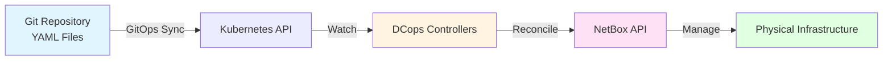
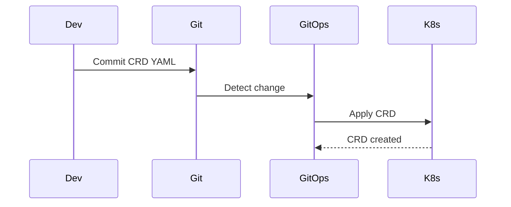
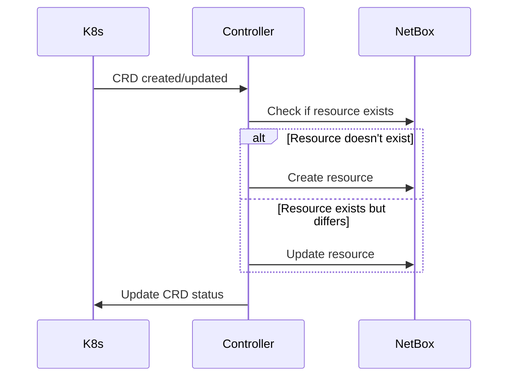
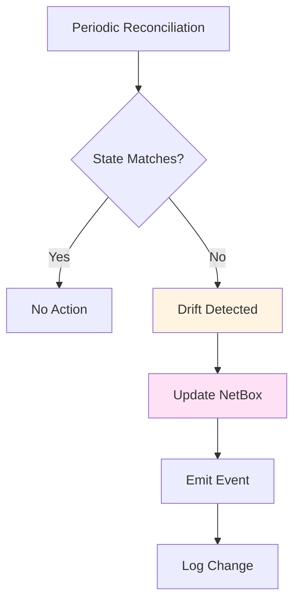

# GitOps Workflow

DCops follows a GitOps workflow where all infrastructure is declared in Git and automatically reconciled.

## The Workflow



## How It Works

### 1. Declare Intent in Git

Define your infrastructure as Kubernetes Custom Resources (CRDs) in YAML files. Commit to Git like any other code.

**Example:**
```yaml
apiVersion: dcops.microscaler.io/v1alpha1
kind: NetBoxSite
metadata:
  name: datacenter-1
spec:
  name: "Data Center 1"
  tenant:
    apiGroup: "dcops.microscaler.io"
    kind: "NetBoxTenant"
    name: "datacenter-tenant"
```

### 2. GitOps Syncs to Kubernetes

Your GitOps tool (FluxCD, ArgoCD, etc.) syncs the YAML files to your Kubernetes cluster:



### 3. Controllers Reconcile Automatically

Kubernetes controllers watch your Git repository and continuously reconcile your declared intent with the actual state in NetBox:



### 4. NetBox Manages State

NetBox serves as your authoritative IPAM and inventory database. Controllers read from and write to NetBox, but you never configure NetBox manually.

### 5. Infrastructure Stays in Sync

If someone manually changes NetBox, controllers detect the drift and either correct it or alert you. Your Git repository always reflects reality.

## Benefits

### Version Control

All changes tracked in Git:
- Complete history of every change
- Who made what change and when
- Easy rollback by reverting commits

### Review Process

Pull requests for all infrastructure changes:
- Code review before changes are applied
- Approval workflow
- Discussion and collaboration

### Audit Trail

Complete history of all changes:
- Git commit history
- Kubernetes events
- NetBox change logs

### Rollback

Revert changes by reverting Git commits:
- Simple `git revert`
- Automatic reconciliation
- No manual cleanup needed

## Example Workflow

### Adding a New Site

1. **Create YAML file:**
   ```yaml
   apiVersion: dcops.microscaler.io/v1alpha1
   kind: NetBoxSite
   metadata:
     name: datacenter-2
   spec:
     name: "Data Center 2"
     tenant:
       apiGroup: "dcops.microscaler.io"
       kind: "NetBoxTenant"
       name: "datacenter-tenant"
   ```

2. **Commit to Git:**
   ```bash
   git add config/sites/datacenter-2.yaml
   git commit -m "feat: add datacenter-2 site"
   git push
   ```

3. **GitOps syncs:**
   - FluxCD/ArgoCD detects change
   - Applies CRD to Kubernetes
   - Controller reconciles
   - Site created in NetBox

4. **Verify:**
   ```bash
   kubectl get netboxsite datacenter-2
   # Check NetBox UI - site should be there
   ```

### Updating a Site

1. **Edit YAML file:**
   ```yaml
   spec:
     name: "Data Center 2 - Updated"
     description: "Updated description"
   ```

2. **Commit and push:**
   ```bash
   git commit -am "feat: update datacenter-2 description"
   git push
   ```

3. **Automatic update:**
   - GitOps syncs change
   - Controller detects change
   - NetBox updated automatically

### Rolling Back

1. **Revert commit:**
   ```bash
   git revert HEAD
   git push
   ```

2. **Automatic rollback:**
   - GitOps syncs reverted state
   - Controller reconciles
   - NetBox updated to previous state

## Drift Detection

DCops automatically detects when NetBox state differs from Git:



**Example:**
- Someone manually deletes a site in NetBox UI
- Controller detects site is missing
- Controller recreates site from Git state
- Kubernetes event emitted: "Site recreated after drift"

## Best Practices

### 1. Use Git Branches

Create branches for changes:
```bash
git checkout -b feature/add-datacenter-2
# Make changes
git commit -m "feat: add datacenter-2"
git push
# Create pull request
```

### 2. Review Before Merge

Always review changes:
- Check YAML syntax
- Verify dependencies exist
- Review resource names
- Check tenant references

### 3. Test in Staging

Use separate namespaces/environments:
- `staging` namespace for testing
- `production` namespace for production
- Test changes before applying to production

### 4. Monitor Events

Watch for reconciliation events:
```bash
kubectl get events -w
```

### 5. Document Changes

Include context in commit messages:
```bash
git commit -m "feat: add datacenter-2 site for expansion

- New datacenter in us-west region
- Will host worker nodes for cluster expansion
- Related to issue #123"
```

## Next Steps

- [Installation Guide](../getting-started/installation.md) - Set up DCops
- [Quick Start](../getting-started/quick-start.md) - Try it out
- [IP Address Allocation](./ip-allocation.md) - Learn about IP management
